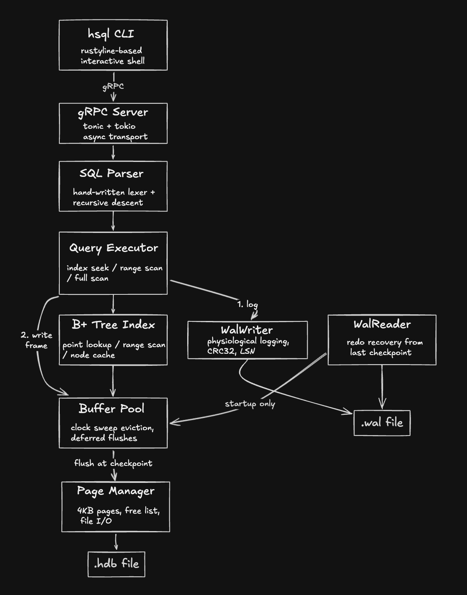

# HozonDB

A relational database engine built from scratch in Rust. The goal is to understand how databases work at the implementation level — storage, indexing, crash recovery, and eventually distributed consensus — by building each piece rather than using existing libraries.

---

## Architecture



**Crate layout:**

| Crate | Role |
|---|---|
| `core` | Storage engine, SQL executor, WAL, buffer pool |
| `server` | gRPC server — runs the database as a standalone process |
| `client` | gRPC client library — transport layer for connecting to the server |
| `hsql` | readline-powered REPL that connects over gRPC |
| `tests` | Integration tests — recovery, persistence, gRPC |

**Page layout:**
```
Page 0:   file header
Page 1:   table catalog  (schema persistence)
Page 2:   index catalog  (index metadata + root page IDs)
Page 3+:  user data pages and B+ tree node pages (shared space)
```

---

## Storage

HozonDB stores all data in a single `.hdb` file. The file is a sequence of fixed-size 4KB pages. Each page has a type:

- **Slotted pages** — row data. Each page has a slot directory at the front and row data growing from the back. Rows have stable `(page_id, slot)` addresses even after updates.
- **Raw pages** — B+ tree index nodes and system catalog pages.
- **Free pages** — released pages tracked in a linked free list, reused on next allocation.

A separate `.wal` file holds the write-ahead log.

---

## Indexing

Every `PRIMARY KEY` column automatically gets a B+ tree index. The index is stored as raw pages within the same `.hdb` file.

```sql
-- auto-creates a B+ tree index on `id`
CREATE TABLE users (id INTEGER PRIMARY KEY, name TEXT);
```

On every `INSERT`, the indexed column value and the row's `RowLocation` (page + slot) are inserted into the tree. On `SELECT WHERE id = 5`, the executor uses the tree to find the exact page and slot in O(log n) rather than scanning all pages.

**Index-eligible operators:**
- `=` — point lookup, reads 1 data page
- `<`, `<=`, `>`, `>=` — range scan, walks the leaf linked list
- All other predicates (`!=`, `AND`, `OR`, compound) — fall back to full scan

---

## Buffer Pool

The buffer pool sits between the executor and disk. Every page read checks the pool first. Every page write goes through it — the change is logged to WAL, the frame is marked dirty, and the actual disk flush is deferred to checkpoint time.

Clock sweep eviction handles memory pressure — referenced frames get a second chance before eviction, the same algorithm PostgreSQL uses.

---

## Write-Ahead Log (WAL)

Every write is logged before it touches a page. HozonDB uses physiological logging — records describe changes at the page and slot level, not raw byte offsets or full SQL statements.

WAL record types:

- `Slotted` — row-level DML (INSERT, UPDATE, DELETE): table, page, slot, old bytes, new bytes
- `Raw` — full page image for B+ tree nodes and catalog pages
- `Checkpoint` — recovery boundary marker
- `LinkPage` — page chain pointer change
- `AllocatePage` — page lifecycle

On startup, `WalReader` replays records from the last checkpoint. Each record is applied only if the target page's stored LSN is older than the record's LSN — idempotent by design.

CRC32 checksum per record detects torn writes. Recovery stops at the last valid record if corruption is detected.

---

## Benchmark Results

**10,000 rows, with B+ tree index on primary key**

| Operation | Duration | BP Hits | Pages Dirtied |
|---|---|---|---|
| SELECT full scan | 11.06ms | 66 | — |
| SELECT idx seek (point lookup) | 0.02ms | 1 | — |
| INSERT (single row) | 8.52ms | 1 | 1 |
| UPDATE (fits slot) | 13.02ms | 1 | 1 |
| UPDATE (exceeds slot) | 29.95ms | 2 | 3 |
| UPDATE bulk 10% (1000 rows) | 12,227.99ms | 1000 | 8 |
| DELETE (single row) | 9.89ms | 1 | 1 |
| DELETE bulk 10% (1000 rows) | 7,740.22ms | 1000 | 8 |

The bulk write cost is the price of the durability guarantee — every WAL append is a synchronous fsync to disk. Group commit (batching fsyncs per transaction) is the planned fix once transactions land.

---

## Status / Roadmap

**Implemented:**
- Slotted page storage with stable row addresses
- Page manager with file locking and free list
- B+ tree indexing — point lookup and range scan
- Index-aware INSERT, UPDATE, DELETE
- PRIMARY KEY uniqueness enforcement
- System catalog with schema and index persistence
- Full SQL CRUD with WHERE filtering and range operators
- Buffer pool with clock sweep eviction
- Write-ahead log with physiological logging, CRC32 checksums, and checkpointing
- Crash recovery via LSN-based redo pass
- gRPC client-server interface (tonic + tokio)
- `hsql` interactive CLI over gRPC

**Known gaps:**
- Dead slot compaction — deleted rows leave dead slots permanently; free space is never reclaimed within a page
- `DROP TABLE` orphans B+ tree index pages — node pages are never freed, only the catalog entry is removed
- Single-page catalog limit — table and index catalogs are each limited to 4KB; overflow returns an error
- SELECT buffers all results — no true server-side streaming
- Index seek for UPDATE/DELETE WHERE — falls back to full scan on indexed columns; correct results, performance gap only
- B+ tree in-memory node cache grows unbounded within a session
- WAL truncation not implemented — `.wal` file grows unbounded; old records before the last checkpoint are never deleted
- `pin_count` in `Frame` exists but is never enforced — safe now (single-threaded), gap when concurrency arrives

**Planned:**
- `BEGIN` / `COMMIT` / `ROLLBACK` transaction support — unlocks group commit and gives `old_data` in WAL records a purpose (rollback)
- `CREATE INDEX` — explicit index creation on any column
- Distributed replication (Raft consensus)

---

## Quick Start

**Start the server:**
```bash
cargo run -p hozondb-server -- mydb
```

Optionally specify a custom address (default: `[::]:50051`):
```bash
cargo run -p hozondb-server -- mydb --addr 0.0.0.0:50051
```

**Connect with the CLI:**
```bash
cargo run -p hsql -- http://localhost:50051
```

```sql
hozondb> CREATE TABLE users (id INTEGER PRIMARY KEY, name TEXT);
hozondb> INSERT INTO users VALUES (1, 'Alice');
hozondb> INSERT INTO users VALUES (2, 'Bob');
hozondb> SELECT * FROM users WHERE id = 1;
hozondb> SELECT * FROM users WHERE id > 1;
hozondb> UPDATE users SET name = 'Alice Smith' WHERE id = 1;
hozondb> DELETE FROM users WHERE id = 2;
hozondb> .exit
```

**Run the benchmark suite:**
```bash
cargo run -p hozondb-core --bin benchmark
```

Optionally pass a custom row count (default: 10,000):
```bash
cargo run -p hozondb-core --bin benchmark -- 50000
```

**Run all tests:**
```bash
cargo test --workspace
```